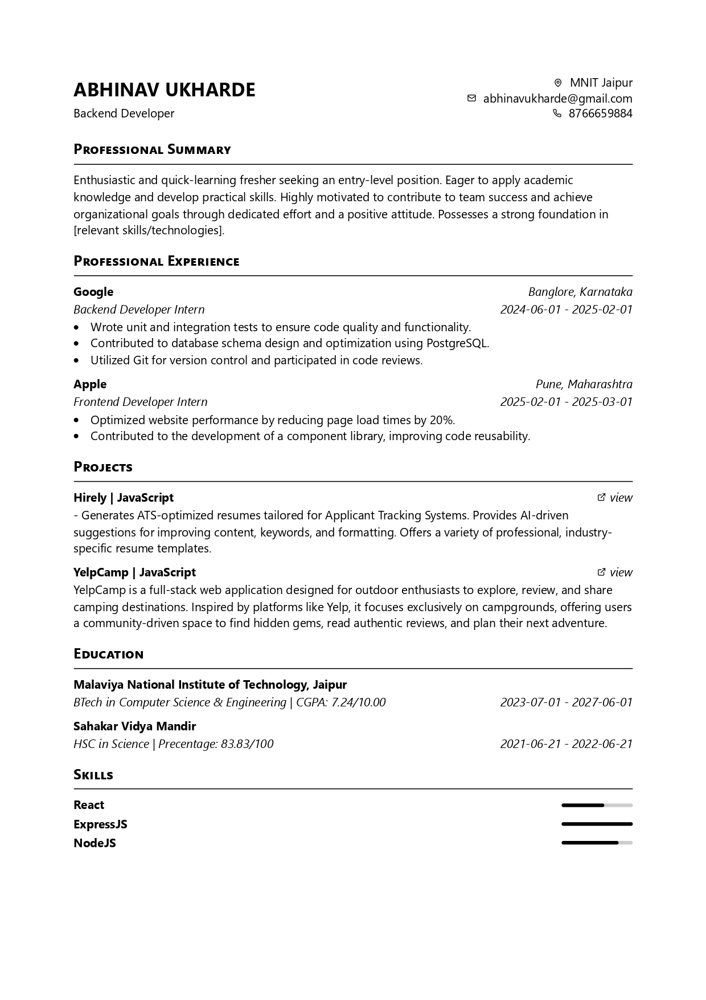
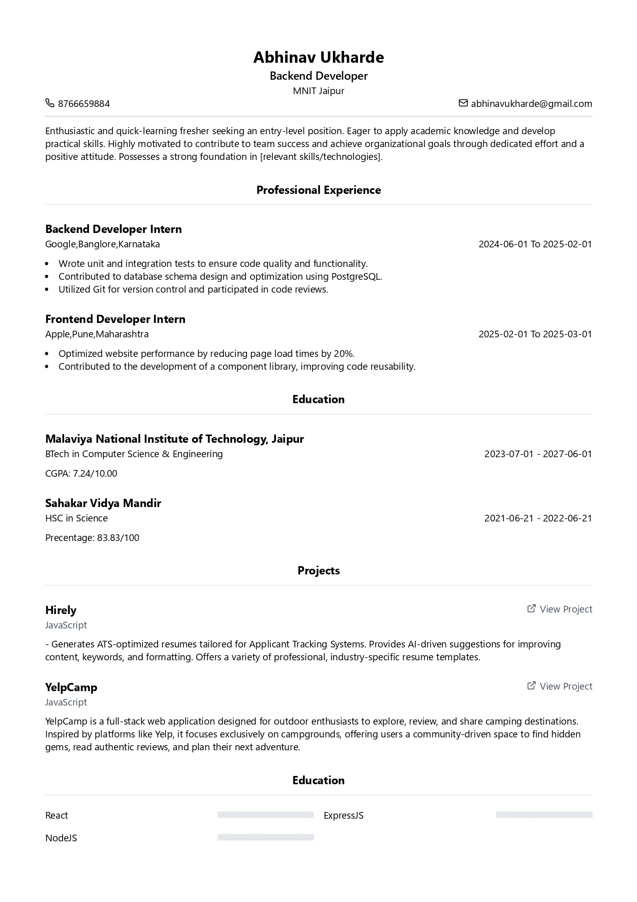
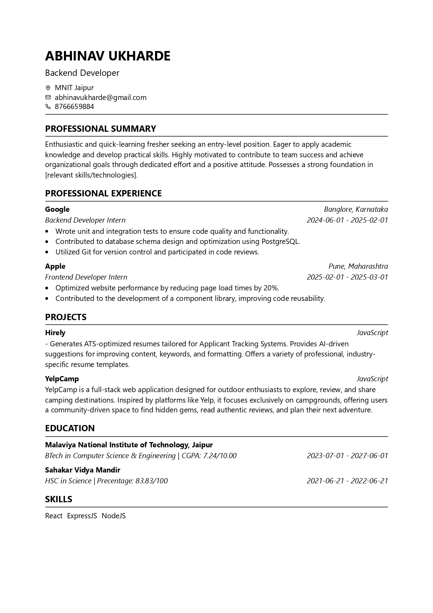

# Hirely

Hirely is a comprehensive resume builder and ATS (Applicant Tracking System) score analyzer application that helps job seekers create professional resumes and test their effectiveness against ATS systems.

## Features

- **Resume Builder**: Create professional resumes using multiple templates
- **Resume Upload**: Upload existing resumes in PDF format
- **ATS Score Analysis**: Check how well your resume performs against ATS systems
- **Resume Management**: Create, edit, and manage multiple resumes
- **User Authentication**: Secure user authentication powered by Clerk
- **Admin Dashboard**: User management features for administrators

## Templates

Hirely offers multiple resume templates to choose from:

### Professional Template


### Modern Template


### Minimal ATS-Optimized Template


## Tech Stack

### Frontend
- React with Vite
- React Router for navigation
- TailwindCSS for styling
- Clerk for authentication
- Axios for API requests

### Backend
- Node.js with Express
- MongoDB for database
- Mongoose for database modeling
- Clerk for authentication

## Setting Up Development Environment

### Prerequisites
- Node.js (v14+ recommended)
- npm or yarn
- MongoDB (local or Atlas)
- Git

### Installation Steps

1. Clone the repository
```bash
git clone https://github.com/yourusername/hirely.git
cd hirely
```

2. Install dependencies for the root project, frontend, and backend
```bash
npm run install-all
```

3. Set up environment variables:

**Backend (.env file in backend directory)**
```
PORT=5000
MONGO_URI=your_mongodb_connection_string
CLERK_SECRET_KEY=your_clerk_secret_key
```

**Frontend (.env.local file in frontend directory)**
```
VITE_CLERK_PUBLISHABLE_KEY=your_clerk_publishable_key
```

4. Start the development servers
```bash
npm start
```

This will concurrently start both the frontend and backend servers:
- Frontend: http://localhost:5173
- Backend: http://localhost:5000

## Usage

1. Sign up or log in using Clerk authentication
2. Navigate to the Dashboard to create a new resume or upload an existing one
3. Select a template and fill in your details
4. Save and export your resume
5. Use the ATS Score Analysis to check your resume performance against job descriptions

## License

[MIT License](LICENSE)